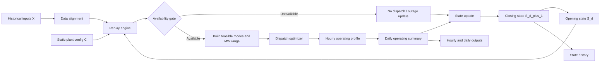

# Stateful Historical Replay Flow

## Purpose

This note defines the first practical run of the gas turbine model:

```text
historical weather + historical power price + historical gas price
plus opening plant state
plus plant operating assumptions
        |
        v
stateful dispatch replay
        |
        v
hourly generation, fuel burn, starts, margin
        |
        v
daily updated plant state
```

The goal is not yet a future forecast. The goal is to prove the model can replay a historical period with a plant that has memory.

Presentation artifacts:

- Mermaid source: [stateful_historical_replay_flowchart.mmd](stateful_historical_replay_flowchart.mmd)
- Standalone SVG: [stateful_historical_replay_flowchart.svg](stateful_historical_replay_flowchart.svg)

This matters because a gas plant is not reset every morning. Yesterday's dispatch changes today's dispatch economics.

```text
Yesterday:
  ran 12 hours
  started once
  accumulated EOH
  fouled slightly
  moved closer to inspection

Today:
  the plant is not the same plant as yesterday morning
```

## Naming Note: `S_d`, Not Continuous-Time SDE

In this note:

```text
S_d = plant state at the start of day d
```

This is a discrete daily state vector. It is not a continuous-time stochastic differential equation.

Later, stochastic outage or degradation processes may be added, but the first implementation should be a discrete state transition:

```text
S_{d+1} = StateUpdate(S_d, dispatch_d, exogenous_d)
```

## The Core Model Object

At day `d`, the model reads:

```text
X_d = exogenous market and weather inputs for day d
C   = static plant and contract configuration
S_d = opening plant state at start of day d
```

It chooses:

```text
u_d = dispatch decision for day d
```

It produces:

```text
Y_d = operating results for day d
S_{d+1} = closing state carried into tomorrow
```

Compact math:

```text
u_d     = Dispatch(X_d, C, S_d)
Y_d     = OperatingResults(u_d, X_d, C, S_d)
S_{d+1} = StateUpdate(S_d, Y_d, X_d, C)
```

For historical replay:

```text
X_d is actual historical data.
C and S_0 may be assumed, calibrated, or read from plant records.
```

## Where LTSA / CSA Terms Fit

LTSA and CSA terms are useful, but they are not all the same kind of model input.

Some terms affect hourly dispatch economics. Some terms affect the daily state update. Some terms affect only monthly or annual cashflow. Mixing those together is a common modeling error.

| LTSA / CSA item | Where it fits | Does it affect hourly dispatch? | Source |
| :--- | :--- | :--- | :--- |
| Fixed monthly fee | Contract / cashflow rollup | Usually no. It is a fixed cost unless contract structure says otherwise. | LTSA/CSA, invoices, budget. |
| EOH reserve rate | Daily state update and cashflow | Sometimes. It may become an avoidable wear cost if dispatch is allowed to consider it. | LTSA/CSA terms. |
| Start overage allowance | Opening contract state and dispatch hurdle | Yes once starts approach or exceed allowance. | LTSA/CSA, amendments. |
| Hot/warm/cold start definitions | Dispatch start-cost logic and EOH update | Yes. Determines start type, start cost, and EOH. | LTSA/CSA, OEM/operator rules. |
| Inspection triggers | State update and outage planning | Indirectly. EOH proximity can change dispatch in Mode B/C. | LTSA/CSA, OEM plan, maintenance records. |
| Planned outage duration | Availability gate and state update | Yes during outage windows. | Outage plan, LTSA/CSA, maintenance schedule. |
| Availability guarantee | Contract rollup and validation | Usually not in basic dispatch, unless modeled as a penalty-avoidance constraint. | LTSA/CSA guarantee formula. |
| Covered vs excluded outage causes | Contract / financial outputs | Not usually in dispatch; affects owner cost and downside. | LTSA/CSA exclusions, outage reports. |
| Heat-rate guarantee | Validation and contract outputs | Usually not in dispatch directly; can create penalty/remedy logic. | LTSA/CSA guarantee terms, test reports. |

The practical rule:

```text
market inputs decide opportunity
plant config decides capability
opening state decides today's condition
LTSA/CSA terms decide which operating events become cost, reserve, outage, or penalty
```

For the first replay, include LTSA/CSA at three levels:

```text
1. Static contract config:
   fixed fee, EOH reserve, start overage rates, inspection thresholds

2. Opening contract state:
   current EOH, starts YTD, reserve balance if known, guarantee period

3. Outputs:
   EOH reserve accrual, start overage exposure, inspection timing, availability metrics
```

Do not let fixed LTSA fees decide one extra dispatch hour unless the contract truly makes that fee avoidable.

## Source And Provenance Layer

Every input should carry a source/provenance tag. This matters because the replay mixes direct data, calculated fields, and assumptions.

Minimum provenance fields:

```text
source_name
source_type
source_file_or_url
snapshot_date
value_status          # direct, calculated, assumed, calibrated
confidence            # high, medium, low
notes
```

Source taxonomy:

| Input family | Examples | Preferred source | Fallback |
| :--- | :--- | :--- | :--- |
| Power price | NYISO node/zone LBMP, DA/RT flag | ISO data, GridStatus, vendor | Zone proxy with explicit basis warning. |
| Weather | Hourly temperature, humidity, AQI | Plant met, station, ERA5 | Nearest station or ERA5 grid point. |
| Gas price | Delivered gas, basis, gas index | Fuel contract, Platts/Argus/NGI, ICE/vendor | Henry Hub plus explicit basis assumption. |
| Plant capability | Pmin/Pmax, mode list, duct firing | Plant docs, OEM curves, EIA-860, ISO registration | Assumed comparable-unit values. |
| Fuel curve | FuelBurn by mode/load/temp | Plant historian, heat-rate test, CEMS plus generation | Assumed piecewise curve. |
| Start costs | Hot/warm/cold start costs | LTSA/CSA, operator budget, plant docs | Transparent assumption. |
| LTSA/CSA | Fixed fees, EOH reserve, overages, guarantees | Actual contract, amendments, invoices | Worked-example assumption. |
| Opening state | EOH, starts YTD, outage status, fouling | Plant records, outage reports, maintenance logs | Initialized assumption. |
| Validation | Actual generation, fuel burn, outages, invoices | CEMS, EIA-923, ISO, plant records | Limited validation only. |

This source layer should be shown in presentation diagrams because it answers the question:

```text
Is this number observed, calculated, assumed, or contract-derived?
```

## Whole Flow: ASCII Map

```text
                                  STATEFUL HISTORICAL REPLAY

  +------------------------------------------------------------------------------------------------+
  | 0. RAW DATA AND STATIC CONFIG                                                                  |
  |                                                                                                |
  | Historical data:                                                                               |
  |   - hourly power price                                                                         |
  |   - hourly temperature                                                                         |
  |   - daily delivered gas price                                                                  |
  |   - optional AQI, humidity, pressure, actual generation, CEMS fuel burn                         |
  |                                                                                                |
  | Static config:                                                                                 |
  |   - plant modes                                                                                |
  |   - Pmin/Pmax curves by mode                                                                   |
  |   - fuel-burn or heat-rate curves by mode                                                      |
  |   - VOM                                                                                        |
  |   - start costs                                                                                |
  |   - min up/down, ramp, outage, LTSA assumptions                                                 |
  +------------------------------------------------------------------------------------------------+
                                                   |
                                                   v
  +------------------------------------------------------------------------------------------------+
  | 1. DATA ALIGNMENT                                                                              |
  |                                                                                                |
  | Build one replay calendar:                                                                     |
  |   - hourly local timestamps                                                                     |
  |   - power price aligned to timestamps                                                           |
  |   - temperature aligned to timestamps                                                           |
  |   - daily gas mapped to each hour                                                               |
  |   - units normalized                                                                            |
  |                                                                                                |
  | Output: aligned exogenous path X_t                                                              |
  +------------------------------------------------------------------------------------------------+
                                                   |
                                                   v
  +------------------------------------------------------------------------------------------------+
  | 2. INITIAL STATE S_0                                                                            |
  |                                                                                                |
  | Opening plant condition:                                                                        |
  |   - available / unavailable                                                                     |
  |   - current online/offline state                                                                |
  |   - hours since last shutdown                                                                   |
  |   - EOH by unit/train                                                                           |
  |   - inspection headroom                                                                         |
  |   - fouling and degradation                                                                     |
  |   - current heat-rate/capacity multipliers                                                      |
  |   - start counters                                                                              |
  |   - outage status                                                                               |
  +------------------------------------------------------------------------------------------------+
                                                   |
                                                   v
  +------------------------------------------------------------------------------------------------+
  | 3. DAILY LOOP                                                                                   |
  |                                                                                                |
  | For each day d:                                                                                 |
  |                                                                                                |
  |   Read opening state S_d                                                                        |
  |         |                                                                                       |
  |         v                                                                                       |
  |   Availability gate                                                                             |
  |         |                                                                                       |
  |         +-- unavailable -> no dispatch, update outage counters                                  |
  |         |                                                                                       |
  |         +-- available ---> build hourly feasible operating set                                  |
  |                                  |                                                             |
  |                                  v                                                             |
  |                            Dispatch optimization                                                |
  |                                  |                                                             |
  |                                  v                                                             |
  |                            Hourly run/mode/MW profile                                           |
  |                                  |                                                             |
  |                                  v                                                             |
  |                            Daily operating summary                                              |
  |                                  |                                                             |
  |                                  v                                                             |
  |                            Engineering and contract update                                      |
  |                                  |                                                             |
  |                                  v                                                             |
  |                            Closing state S_{d+1}                                                |
  +------------------------------------------------------------------------------------------------+
                                                   |
                                                   v
  +------------------------------------------------------------------------------------------------+
  | 4. REPLAY OUTPUTS                                                                               |
  |                                                                                                |
  | Hourly:                                                                                         |
  |   - online flag                                                                                 |
  |   - mode                                                                                        |
  |   - MW / MWh                                                                                    |
  |   - price, gas, temperature                                                                     |
  |   - fuel burn                                                                                   |
  |   - margin                                                                                      |
  |                                                                                                |
  | Daily:                                                                                          |
  |   - fired hours                                                                                 |
  |   - starts by type                                                                              |
  |   - EOH added                                                                                   |
  |   - fuel burn                                                                                   |
  |   - gross margin                                                                                |
  |   - closing state                                                                               |
  |                                                                                                |
  | Monthly / annual:                                                                               |
  |   - MWh                                                                                         |
  |   - capacity factor                                                                             |
  |   - fuel cost                                                                                   |
  |   - spark spread capture                                                                        |
  |   - LTSA / outage / maintenance signals                                                         |
  +------------------------------------------------------------------------------------------------+
```

## Mermaid Flow For Obsidian



## First Principle: Inputs Are Not All The Same Kind Of Thing

The model needs four different input classes.

| Input class | Examples | Source style | Can be read directly? |
| :--- | :--- | :--- | :--- |
| Exogenous historical paths | Power price, temperature, gas price | ISO, weather, gas market data | Usually yes after cleaning. |
| Static plant configuration | Modes, Pmin/Pmax curves, fuel curve, start costs, VOM | Plant docs, EIA, CEMS, assumptions | Often partly calculated or assumed. |
| Opening state | EOH, fouling, outage status, hours since shutdown | Plant records, inferred history, assumption | Usually not fully public. |
| Derived model signals | Spark spread, effective Pmax, starts, EOH added, fuel burn | Model calculation | No, calculated by replay. |

Do not mix these up. A raw label from EIA or NYISO is different from a calculated model state.

## Exogenous Path Inputs

These are the outside-world inputs for historical replay.

### Hourly Power Price

| Field | Example | Direct or calculated? | Source | Nuance |
| :--- | :--- | :--- | :--- | :--- |
| `timestamp` | `2022-07-15 14:00 America/New_York` | Direct after calendar cleaning | ISO / GridStatus / vendor | DST must be explicit. |
| `power_price` | `87.25 USD/MWh` | Direct | NYISO LBMP, node/zone/hub price | Need node vs zone vs hub and DA vs RT basis. |
| `power_location` | `NYISO Zone F`, node PTID, or plant node | Direct label | ISO or vendor | Wrong location creates basis error. |
| `power_market_basis` | `DA` or `RT` | Direct label or modeling choice | ISO data choice | Dispatch/revenue framing must match. |

For first replay:

```text
Use one price series.
Label it clearly.
Do not mix DA and RT silently.
```

For Lockport-style work:

```text
power market = NYISO
candidate price = plant node if available, otherwise relevant NYISO zone
```

### Hourly Temperature

| Field | Example | Direct or calculated? | Source | Nuance |
| :--- | :--- | :--- | :--- | :--- |
| `ambient_temp` | `82.4 deg F` | Direct after unit conversion | Weather station, ERA5, plant historian | Must be near enough to plant intake conditions. |
| `weather_source` | `ERA5`, station id, plant met | Direct label | Weather source | Source affects confidence. |
| `temp_unit` | `deg F` or `deg C` | Direct label | Data source | Must match derate coefficient. |

Temperature matters in two places:

```text
1. It changes effective capacity.
2. It changes heat-rate / fuel-burn efficiency.
```

For first replay:

```text
Use hourly ambient temperature.
Add humidity/AQI later unless already easy.
```

### Daily Delivered Gas Price

| Field | Example | Direct or calculated? | Source | Nuance |
| :--- | :--- | :--- | :--- | :--- |
| `delivered_gas_price` | `4.35 USD/MMBtu` | Direct if actual index/invoice; otherwise calculated | Fuel contract, Platts/Argus/NGI, EIA + basis | Plant burns delivered gas, not generic gas. |
| `gas_location` | `TGP Zone 5 / Niagara proxy` | Direct label or modeling choice | Contract/pipeline/vendor | Must not be confused with power node. |
| `henry_hub_component` | `3.90 USD/MMBtu` | Direct | EIA/CME/vendor | Benchmark component. |
| `gas_basis_component` | `0.35 USD/MMBtu` | Direct from vendor or assumption | ICE/vendor/broker/assumption | Key local fuel risk. |
| `transport_adder` | `0.05 USD/MMBtu` | Contract or assumption | Fuel contract/tariff/assumption | Often missing in early runs. |

For first replay:

```text
daily gas price is acceptable.
Map the same daily gas price to all 24 power-market hours.
Flag the gas-day simplification.
```

## Static Plant Configuration

Static configuration is everything the model needs to know about the plant before state evolves.

### Plant Modes

A gas plant may have multiple operating modes.

| Plant type | Typical modes | Why it matters |
| :--- | :--- | :--- |
| Simple-cycle GT | off, 1 GT online | Simpler mode set. |
| 2x1 CCGT | off, 1x1, 2x1, maybe duct firing | Different Pmin/Pmax, heat-rate curves, start costs, HRSG stress. |
| Multi-unit CT site | off, 1 unit, 2 units, ... | Dispatch can commit units independently. |
| CHP | electric-led, steam-led, bypass/condensing | Steam obligation changes dispatch economics. |

For the first CCGT replay, define:

```text
modes = {off, 1x1, 2x1}
```

If this is too much for the first code pass, start with:

```text
modes = {off, simplified_combined_cycle}
```

but label it as a simplified mode model.

### Pmin And Pmax Curves

Pmin and Pmax are not single universal values. They can vary by:

- mode
- ambient temperature
- degradation state
- outage/derate status
- emissions or operating limits

Model form:

```text
Pmax_eff(m,t,S_d)
  = Pmax_base_m(temp_t)
  * capacity_degradation_multiplier(S_d)
  * outage_derate_multiplier(S_d)

Pmin_eff(m,t,S_d)
  = Pmin_base_m(temp_t)
  * pmin_adjustment(S_d)
```

Input source hierarchy:

| Item | Best source | Gen 1 fallback |
| :--- | :--- | :--- |
| Nameplate / summer / winter capacity | Plant docs, EIA-860, NYISO registration | EIA nameplate plus assumed seasonal derate. |
| Temperature derate curve | OEM/plant performance curve | Linear derate coefficient. |
| Pmin by mode | Plant docs, offer data, operator notes | Assumed percent of Pmax. |
| Degradation multiplier | Plant condition records | Start at 1.0 and update simply. |

### Fuel-Burn Curve / Heat-Rate Curve

This is the precision point you raised: heat rate should not be treated as one scalar in the real dispatch model.

Preferred model object:

```text
FuelBurn_m(P,T,S_d)
```

Where:

```text
m = operating mode
P = MW output
T = ambient temperature
S_d = opening plant state
```

Then:

```text
AverageHR_m(P,T,S_d) = FuelBurn_m(P,T,S_d) / P
IncrementalHR_m(P,T,S_d) = derivative of FuelBurn with respect to P
```

Dispatch economics should use the fuel-burn curve directly:

```text
fuel_cost_t(P,m)
  = GasPrice_d * FuelBurn_m(P,temp_t,S_d)
```

Common Gen 1 representation:

```text
For each mode m:
  define heat-rate points at Pmin, mid-load, Pmax
  interpolate between points
```

Example structure:

| Mode | MW point | Average heat rate | Source |
| :--- | ---: | ---: | :--- |
| 1x1 | Pmin_1x1 | assumed or fitted | Plant docs / CEMS / assumption |
| 1x1 | mid_1x1 | assumed or fitted | Plant docs / CEMS / assumption |
| 1x1 | Pmax_1x1 | assumed or fitted | Plant docs / CEMS / assumption |
| 2x1 | Pmin_2x1 | assumed or fitted | Plant docs / CEMS / assumption |
| 2x1 | mid_2x1 | assumed or fitted | Plant docs / CEMS / assumption |
| 2x1 | Pmax_2x1 | assumed or fitted | Plant docs / CEMS / assumption |

Source hierarchy:

| Fuel-curve input | Best source | Gen 1 fallback | Important warning |
| :--- | :--- | :--- | :--- |
| Mode-specific fuel curve | Plant heat-rate test, OEM curve, plant historian, CEMS + gross/net generation | Assumed curve from comparable unit | EIA rarely gives full hourly load-specific curve. |
| Heat input | CEMS hourly heat input | EIA-923 monthly fuel as coarse check | CEMS is emissions-reporting data, not a perfect dispatch dataset. |
| Net generation by unit | Plant historian / ISO settlement / CEMS gross load if available | EIA monthly generation | Need net vs gross consistency. |
| Temperature correction | OEM/plant correction curve | Linear multiplier | Units must match deg F vs deg C. |
| Degradation correction | Plant records / tests | State multiplier | Do not double count fouling and heat-rate degradation. |

### VOM

VOM is non-fuel variable operating cost per MWh.

| VOM component | Direct or calculated? | Source | Gen 1 treatment |
| :--- | :--- | :--- | :--- |
| Routine variable O&M | Assumption or contract | Plant budget, diligence, generic benchmarks | Fixed `USD/MWh`. |
| LTSA variable reserve | Contract/calculate from EOH | LTSA/CSA terms | Add later or include as wear cost. |
| Emissions variable cost | Calculated | Emission rate * allowance price | Optional first run. |
| Water/consumables | Assumption | Plant data | Optional first run. |

For first replay:

```text
VOM = fixed USD/MWh assumption
```

### Start Costs

Start cost is not one universal number.

It can vary by:

- hot, warm, cold start
- mode: 1x1 vs 2x1
- number of GTs started
- HRSG/ST participation
- fuel consumed during startup
- wear/EOH reserve
- start overage exposure

Start type is calculated from state:

```text
hours_since_last_shutdown -> hot / warm / cold
```

Example:

```text
if hours_since_shutdown < hot_threshold:
  start_type = hot
elif hours_since_shutdown < warm_threshold:
  start_type = warm
else:
  start_type = cold
```

Start cost structure:

```text
start_cost(mode,start_type,S_d)
  = start_fuel_cost
  + start_aux_cost
  + start_wear_cost
  + expected_contract_overage_cost
```

For the first run:

```text
Use fixed start cost by start type.
Use hours_since_shutdown to classify start type.
Ignore start overages until the base run works.
```

## Opening State Vector `S_d`

The opening state is the model's memory.

Minimum first-run state:

| State variable | Type | Direct or calculated? | Why dispatch needs it |
| :--- | :--- | :--- | :--- |
| `available` | boolean | Direct if outage record, else initialized/calculated | If false, no dispatch. |
| `current_mode` | enum | Calculated from prior hour/day or initialized | Needed for start/shutdown logic. |
| `hours_since_shutdown` | number | Calculated from prior dispatch or initialized | Determines hot/warm/cold start. |
| `eoh_by_unit` | number | Direct from plant records or initialized | Inspection headroom and contract state. |
| `next_inspection_eoh` | number | Contract/assumption | Defines headroom. |
| `inspection_headroom` | number | Calculated | Can affect wear/EOH penalty. |
| `fouling_index` | percent | Calculated or initialized | Affects heat rate and capacity. |
| `hr_degradation_multiplier` | multiplier | Calculated or initialized | Affects fuel burn. |
| `capacity_degradation_multiplier` | multiplier | Calculated or initialized | Affects Pmax. |
| `planned_outage_active` | boolean | Direct from outage calendar or calculated | Blocks dispatch. |
| `forced_outage_active` | boolean | Direct or stochastic | Blocks dispatch. |
| `outage_hours_remaining` | number | Direct/calculated | Carries outage across days. |
| `starts_ytd_by_type` | count | Direct/calculated | Contract overage tracking. |

Optional later state:

| State variable | Why later |
| :--- | :--- |
| Creep damage fraction | Needed for deeper engineering risk, not first dispatch test. |
| Fatigue damage fraction | Needed for cycling damage, not first run. |
| TBC life state | Useful for failure model, not first replay. |
| HRSG drum fatigue | Important for CCGT starts, can wait. |
| Rotor life consumed | Tail risk, can wait. |
| LTSA reserve balance | Financial layer, can wait until operations work. |

## Daily Dispatch Logic

For each day `d`, read:

```text
S_d
X_d = {price_t, temp_t, gas_d for all hours t in day d}
C
```

### Step 1: Availability Gate

```text
if planned_outage_active or forced_outage_active:
  dispatch_t = off for all t
  update outage counters
  skip economic dispatch
```

If partial derate:

```text
outage_derate_multiplier < 1.0
```

Then dispatch is allowed but with lower Pmax.

### Step 2: Build Feasible Operating Set

For every hour `t` and mode `m`:

```text
Pmin_eff(m,t,S_d)
Pmax_eff(m,t,S_d)
```

The feasible set is:

```text
off
or
mode m with P in [Pmin_eff, Pmax_eff]
```

subject to:

```text
min up / min down
ramp constraints
mode transition constraints
emissions/fuel constraints if modeled
```

### Step 3: Compute Hourly Economics

For each feasible mode and load:

```text
fuel_burn_t(P,m)
  = FuelBurn_m(P,temp_t,S_d)

fuel_cost_t(P,m)
  = gas_d * fuel_burn_t(P,m)

vom_cost_t(P,m)
  = VOM_m * P

gross_margin_t(P,m)
  = price_t * P
  - fuel_cost_t(P,m)
  - vom_cost_t(P,m)
```

If using marginal-cost style offers:

```text
incremental_cost_t(P,m)
  = IncrementalHR_m(P,temp_t,S_d) * gas_d
  + VOM_m
```

### Step 4: Include Starts

A start happens when:

```text
mode_{t-1} = off
mode_t != off
```

Start cost:

```text
start_cost_t
  = StartCost(mode_t, start_type_t, S_d)
```

A run should not start unless the expected run value clears start cost:

```text
sum margin over run block > start_cost
```

This is why a single positive spark-spread hour should not automatically create a start.

### Step 5: Dispatch Optimization

There are three implementation levels.

| Level | Method | Use |
| :--- | :--- | :--- |
| A | Hourly spark screen | Fast data sanity check. |
| B | Run-block heuristic with start-cost recovery | Good first replay. |
| C | Dynamic programming / unit commitment | Best for min up/down, starts, modes. |

Level B is the recommended first real run.

Pseudo-logic:

```text
for each day:
  compute hourly margin for each mode/load choice
  identify profitable contiguous blocks
  keep blocks where block margin > start cost
  enforce min up/down simply
  choose mode/load with highest margin
```

Level C state grid:

```text
dispatch_state_t:
  mode
  hours_online
  hours_offline
  last_start_type
```

Objective:

```text
maximize sum_t operating_margin_t
       - sum_starts start_cost
```

subject to:

```text
Pmin/Pmax
ramp
min up/down
mode transition rules
availability
```

## Daily State Update

After hourly dispatch is chosen, compute daily summaries.

### Operating Summary

```text
fired_hours_d = count hours online
MWh_d = sum_t MW_t
fuel_burn_d = sum_t FuelBurn_t
starts_d = count off -> online transitions
run_blocks_d = list of run intervals
gross_margin_d = sum_t gross_margin_t - start_costs_d
```

### EOH Update

Simple first-run form:

```text
EOH_added_d
  = fired_hours_d
  + hot_starts_d  * hot_start_EOH
  + warm_starts_d * warm_start_EOH
  + cold_starts_d * cold_start_EOH
```

More detailed later:

```text
EOH_added_d
  = fired_hour_EOH(load_profile)
  + start_EOH(start_type, mode)
  + trip_EOH
  + load_swing_EOH
```

State update:

```text
EOH_{d+1} = EOH_d + EOH_added_d
headroom_{d+1} = next_inspection_EOH - EOH_{d+1}
```

### Fouling Update

Simple first-run form:

```text
fouling_{d+1}
  = min(fouling_max,
        fouling_d + fouling_rate_per_fired_hour * fired_hours_d)
```

Better form:

```text
fouling_{d+1}
  = fouling_d
  + (fouling_asymptote - fouling_d)
    * (1 - exp(-fired_hours_d / tau))
    * AQI_multiplier_d
```

If a wash occurs:

```text
fouling_{d+1} = fouling_{d+1} * (1 - wash_recovery_fraction)
```

### Heat-Rate And Capacity State

```text
hr_degradation_multiplier_{d+1}
  = 1.0
  + nonrecoverable_hr_degradation
  + fouling_hr_penalty(fouling_{d+1})

capacity_degradation_multiplier_{d+1}
  = 1.0
  - capacity_loss_from_degradation
  - capacity_loss_from_fouling(fouling_{d+1})
```

These multipliers feed tomorrow's dispatch.

### Outage Update

First run:

```text
Use known outage calendar if available.
Otherwise keep forced outages off.
```

Next level:

```text
forced_outage_probability_d
  = base_hazard
  + stress_multiplier(S_d)
  + EOH_proximity_multiplier(S_d)
```

If outage is triggered:

```text
forced_outage_active_{d+1} = true
outage_hours_remaining = sampled_duration
```

Do not add stochastic forced outages before the deterministic replay works.

## Input Table: Direct, Calculated, Assumed

This table is the practical checklist for the first implementation.

| Item | Needed for first run? | Direct label/data? | Usually calculated? | If missing |
| :--- | :--- | :--- | :--- | :--- |
| Hourly timestamp | Yes | Yes | Calendar cleaning | Stop until fixed. |
| Hourly power price | Yes | Yes | Basis adjustment optional | Use zone/hub with label. |
| Power location | Yes | Yes | No | Label confidence. |
| DA/RT basis | Yes | Yes | No | Pick one and label. |
| Hourly temperature | Yes | Yes | Unit conversion | Use nearest station/ERA5. |
| Daily delivered gas price | Yes | Sometimes | Often HH + basis + delivery | Use explicit proxy flag. |
| Gas location/index | Yes | Sometimes | Modeling choice | Use best proxy hierarchy. |
| Plant modes | Yes | Sometimes | Assumption | Start simplified. |
| Pmax/Pmin by mode | Yes | Partly | Temperature/degradation adjustment | Use EIA/plant docs/assumption. |
| Fuel-burn curve by mode | Yes | Rarely direct | Fit or assume | Use piecewise curve. |
| Heat-rate curve | Yes | Rarely direct | Derived from fuel curve | Do not use single scalar except sanity screen. |
| VOM | Yes | Rarely public | Assumption | Use transparent fixed value. |
| Start cost by type | Yes for stateful run | Usually contract/assumption | Can decompose later | Use assumed hot/warm/cold. |
| Start type thresholds | Yes | Contract/OEM/assumption | No | Use simple thresholds. |
| Min up/down | Preferred | Plant/market/assumption | No | Start with simplified rules. |
| Ramp rate | Later | Plant/market/assumption | No | Ignore in Level B if needed. |
| Opening online state | Yes | If actual generation exists | Infer from generation | Initialize offline if unknown. |
| Hours since shutdown | Yes for start type | Rare | Infer from prior dispatch | Initialize conservatively. |
| Opening EOH | Yes for state loop | Plant records | Assumption if missing | Use explicit initial EOH. |
| Inspection threshold | Yes for headroom | LTSA/OEM/assumption | No | Use assumed threshold. |
| Fouling state | Preferred | Plant records | Initialize/update | Start at zero or assumed. |
| Outage calendar | Preferred | Plant/ISO/EIA/GADS if available | No | Start with no outage, label. |
| Actual generation | For validation | CEMS/EIA/ISO/plant | No | Replay still possible without validation. |
| Actual fuel burn | For validation | CEMS/plant | No | Use EIA-923 monthly as coarse check. |

## First-Run Model Levels

### Level A: Static Spark Screen

Use for data sanity only.

```text
price_t
temperature_t
gas_d
single Pmax
single heat rate
single VOM
```

Output:

```text
hourly clean spark spread
rough run/off
rough MWh and margin
```

This level is not a real plant model.

### Level B: Stateful Single-Mode Replay

Recommended first implementation.

```text
one operating mode
Pmin/Pmax adjusted by temperature and state
piecewise heat-rate curve
daily gas
start-cost recovery
opening state and daily state update
```

This proves the memory loop.

### Level C: Stateful Multi-Mode Replay

Use after Level B works.

```text
off / 1x1 / 2x1
mode-specific Pmin/Pmax
mode-specific fuel curve
mode-specific start costs
min up/down
simple mode transition rules
```

This is closer to the intended CCGT model.

### Level D: Engineering-Risk Replay

Use later.

```text
creep/fatigue
TBC failure
HRSG cycling
rotor risk
stochastic forced outage
LTSA cost classification
```

Do not start here.

## Output Schemas

### Hourly Dispatch Output

| Column | Meaning |
| :--- | :--- |
| `timestamp` | Hourly timestamp. |
| `date` | Local date. |
| `price` | Power price used. |
| `temperature` | Temperature used. |
| `gas_price` | Daily gas mapped to hour. |
| `available` | Availability after outage gate. |
| `mode` | Off, 1x1, 2x1, etc. |
| `online` | Boolean. |
| `mw` | Dispatch MW. |
| `mwh` | Hourly MWh. |
| `fuel_burn_mmbtu` | Fuel burn from fuel curve. |
| `avg_heat_rate` | Fuel burn / MWh. |
| `incremental_cost` | If calculated. |
| `gross_revenue` | `price * mwh`. |
| `fuel_cost` | `gas_price * fuel_burn`. |
| `vom_cost` | VOM cost. |
| `gross_margin_before_start` | Revenue minus fuel and VOM. |
| `start_flag` | Start in this hour. |
| `start_type` | Hot/warm/cold. |
| `start_cost` | Start cost charged. |

### Daily State Output

| Column | Meaning |
| :--- | :--- |
| `date` | Local date. |
| `opening_eoh` | EOH at start of day. |
| `eoh_added` | EOH created by today's operation. |
| `closing_eoh` | EOH carried forward. |
| `opening_headroom` | Inspection headroom at start. |
| `closing_headroom` | Inspection headroom after update. |
| `fired_hours` | Hours online. |
| `starts_hot` | Hot starts. |
| `starts_warm` | Warm starts. |
| `starts_cold` | Cold starts. |
| `mwh` | Daily MWh. |
| `fuel_burn` | Daily fuel burn. |
| `gross_margin` | Daily margin after starts. |
| `opening_fouling` | Fouling at start. |
| `closing_fouling` | Fouling after update. |
| `hr_multiplier` | Heat-rate state for next day. |
| `capacity_multiplier` | Capacity state for next day. |
| `outage_status` | Available/planned outage/forced outage. |

### Monthly Summary Output

| Column | Meaning |
| :--- | :--- |
| `month` | Month. |
| `mwh` | Total generation. |
| `capacity_factor` | MWh / available theoretical MWh. |
| `gross_revenue` | Total energy revenue. |
| `fuel_cost` | Total fuel cost. |
| `vom_cost` | Total VOM. |
| `start_cost` | Total start cost. |
| `gross_margin` | Revenue minus variable costs. |
| `starts_total` | Total starts. |
| `eoh_added` | Total EOH added. |
| `avg_dispatch_heat_rate` | Fuel burn / MWh. |
| `spark_spread_capture` | Dispatch-weighted spread metric. |

## Validation Checks

Before trusting a replay, run these checks.

### Data Checks

| Check | Failure mode |
| :--- | :--- |
| Hour count per day/month | DST/calendar errors. |
| Price unit | USD/MWh vs cents/kWh or wrong market basis. |
| Gas unit | USD/MMBtu vs USD/Mcf. |
| Temperature unit | deg F vs deg C. |
| Gas daily mapping | Wrong date or gas-day mismatch. |
| Missing values | Silent gaps create false dispatch decisions. |

### Engineering Checks

| Check | Failure mode |
| :--- | :--- |
| Pmin <= Pmax every hour | Bad derate or mode config. |
| Heat rate range plausible | Bad fuel curve or unit conversion. |
| Fuel burn non-negative | Curve/interpolation error. |
| Starts counted correctly | State transition bug. |
| EOH never decreases except reset event | State update bug. |
| Fouling bounded by asymptote | Fouling update bug. |

### Replay Checks

If actual generation/fuel data is available:

| Compare | What it tests |
| :--- | :--- |
| Simulated MWh vs actual MWh | Dispatch logic. |
| Simulated starts vs actual starts | Start-cost/min-up/down assumptions. |
| Simulated fuel burn vs CEMS fuel burn | Fuel curve. |
| Simulated capacity factor vs actual | Availability and dispatch. |
| Simulated heat rate vs actual | Fuel curve and degradation state. |
| Simulated outage periods vs known outages | Outage calendar/gate. |

If actual operation data is not available:

```text
The replay is still useful for scenario mechanics,
but it is not validated plant behavior.
```

## Implementation Sequence

Use this order.

```text
1. Build aligned historical input table.
2. Build static config with explicit assumptions.
3. Initialize S_0.
4. Run one day by hand or notebook.
5. Check every line of the hourly dispatch output.
6. Run one month.
7. Check daily state transitions.
8. Compare to actual generation/fuel if available.
9. Add modes.
10. Add richer state update.
11. Add outages and LTSA costs.
```

The one-day hand check is important. If the model cannot explain one day, the monthly output is not useful.

## One-Day Worked Skeleton

```text
Inputs for day d:
  opening EOH = 24,000
  next inspection = 32,000
  opening fouling = 0.0%
  available = true
  hours since shutdown = 48
  gas price = 4.00 USD/MMBtu
  24 hourly power prices
  24 hourly temperatures

Static config:
  mode = simplified CCGT
  Pmin = 200 MW
  Pmax at 59F = 500 MW
  heat-rate curve:
    200 MW -> 8.4 MMBtu/MWh
    350 MW -> 7.4 MMBtu/MWh
    500 MW -> 7.1 MMBtu/MWh
  VOM = 3.50 USD/MWh
  warm start cost = 25,000 USD
  warm start EOH = 100

Dispatch:
  choose hours and MW where block margin exceeds start cost

Operating result:
  fired hours = 10
  MWh = 4,500
  fuel burn = 32,500 MMBtu
  starts = 1 warm
  margin = revenue - fuel - VOM - start cost

State update:
  EOH added = 10 fired hours + 100 warm start EOH
  closing EOH = 24,110
  closing headroom = 32,000 - 24,110 = 7,890
  fouling increases slightly
  tomorrow HR multiplier increases slightly
```

## What This Means For The First Data You Share

When you share the data, the first mapping should be:

| Data you provide | Model slot |
| :--- | :--- |
| Hourly price | `price_t` in exogenous path. |
| Hourly temperature | `temp_t` in exogenous path. |
| Daily gas price | `gas_d` in exogenous path. |
| Plant capacity info | Pmin/Pmax config, not state by itself. |
| Heat-rate info | Fuel curve / heat-rate curve config. |
| Actual generation | Validation target, not required input unless replaying actual dispatch. |
| Fuel burn | Fuel-curve calibration and validation. |
| Outage records | Availability gate and validation. |
| EOH/maintenance records | Opening state and state update calibration. |

The first model should not wait for every perfect plant document. But it should be honest about what is direct, calculated, and assumed.

## Local References

- `/Users/divy/code/work/infrasure_git_codes/gt_models/docs/plans/step_2_execution_blueprint_plan.md`
- `/Users/divy/code/work/infrasure_git_codes/gt_models/docs/plans/step_1_climate_price_scenario_plan.md`
- `/Users/divy/code/work/infrasure_git_codes/gt_models/docs/learning/basics/05_dispatch_and_daily_loop.md`
- `/Users/divy/code/work/infrasure_git_codes/gt_models/docs/learning/basics/07_state_vector_and_feedback.md`
- `/Users/divy/code/work/infrasure_git_codes/gt_models/docs/learning/market_and_operations/02_marginal_cost_and_offer_curves.md`
- `/Users/divy/code/work/infrasure_git_codes/gt_models/docs/learning/market_and_operations/04_weather_adjusted_operating_curves.md`
- `/Users/divy/code/work/infrasure_git_codes/gt_models/docs/extra/basics_of_gas_prices.md`
