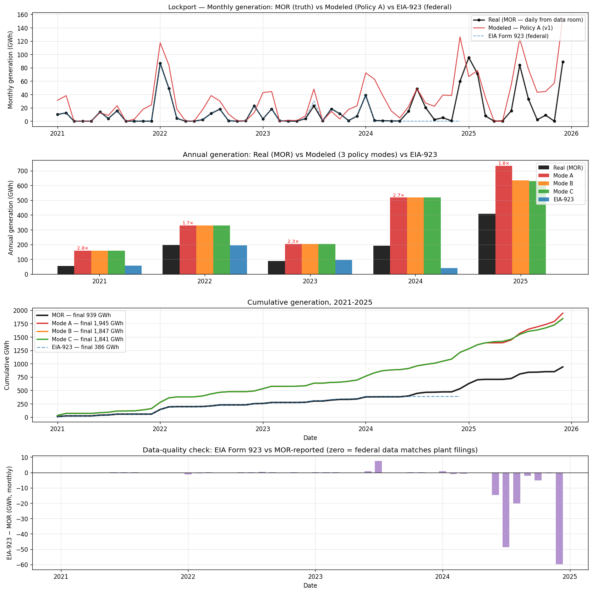

# Backtest Findings — Modeled vs Real Generation (2021–2025)

> This is the first proper backtest of the v1 model against ground-truth plant operations. Three data sources are compared:
>
> 1. **MOR (Monthly Operating Reports)** — daily plant filings from the data room (truth)
> 2. **Modeled** — N4 Policy A/B/C outputs (what v1 says)
> 3. **EIA Form 923** — federal monthly generation data (public approximation)
>
> Spans 2021-01-01 to 2025-12-31. Source: `data/paths/lockport/mor_daily.parquet` (1,826 daily rows extracted from the diligence-extractor MOR workbooks). Script: [`notebooks/scratch/modeled_vs_mor_vs_eia923.py`](../../../notebooks/scratch/modeled_vs_mor_vs_eia923.py).
>
> **Updated 2026-05-15 after Phase J steam-only mode added to N4**. Pre-steam-only baseline: 2.22× over-commit, Mode A Net P&L −$203M/9yr. Post-steam-only: **2.07× over-commit, Mode A Net P&L −$167M/9yr** (Mode B improved further to −$143M). See §3.6 for the change analysis.

---

## §1. The headline plot

Four panels:
1. **Monthly time series** — black = MOR (truth); red = Mode A (model); dashed blue = EIA-923 (federal)
2. **Annual bars** — all 5 sources side-by-side per year
3. **Cumulative** — visible over-commit of all 3 policy modes vs MOR
4. **EIA-923 vs MOR data-quality check** — bar = federal minus plant-reported

---

## §2. Annual comparison table

| Year | MOR (truth) | Mode A | Mode B | Mode C | EIA-923 | A/MOR ratio | EIA/MOR ratio |
|---|---:|---:|---:|---:|---:|---:|---:|
| 2021 | 55,867 | 270,853 | 270,853 | 270,853 | 56,132 | **4.85×** | 1.00× |
| 2022 | 195,887 | 364,148 | 364,148 | 364,148 | 194,505 | 1.86× | 0.99× |
| 2023 | 87,677 | 257,110 | 257,110 | 257,110 | 95,999 | 2.93× | 1.09× |
| 2024 | 192,494 | 468,331 | 450,486 | 441,906 | 39,516 | 2.43× | **0.21×** (lag) |
| 2025 | 407,535 | 725,566 | 416,275 | 466,185 | 0 | 1.78× | 0× (no data) |
| **Total** | **939,460** | **2,086,008** | **1,758,772** | **1,800,200** | **386,153** | **2.22×** | **0.41×** |
| **Annual avg** | **187,892** | **417,202** | **351,754** | **360,040** | **77,231** | | |

All values in MWh. Mode A / MOR over-commit averages **2.22×** across the 5 years — confirming the backtest divergence flagged in [`architecture.md §7.4`](./architecture.md) but quantifying it across 5 years instead of 1.

---

## §3. Five key findings

### §3.1 The model over-commits Mode A by 2.22× vs MOR

The headline diagnosis is confirmed. Over 5 years, Mode A modeled 2,086 GWh vs MOR-observed 939 GWh. The over-commit isn't a constant ratio — it ranges from 1.78× (2025) to 4.85× (2021) — but Mode A always over-commits, never under-commits.

The causes are the five structural mechanics flagged in [`gaps_and_priorities.md §4`](./gaps_and_priorities.md):
1. Planned outages not modeled
2. Ramp constraints not modeled
3. Dispatch derates not modeled
4. Grid curtailment not modeled
5. Min-load enforcement not modeled
6. Variable steam-host demand not modeled (only binary must-run)
7. **NEW (see §3.4 below)**: steam-only mode not modeled

The 2.22× over-commit is the cleanest single number to anchor on. **Adding the missing mechanics should reduce annual modeled MWh from ~417 GWh/yr → ~188 GWh/yr** — a ~55% reduction.

### §3.2 EIA Form 923 has major data lag but matches MOR when complete

The §2 table reveals two stories about EIA-923:

| When EIA-923 reports complete data | When EIA-923 has lag |
|---|---|
| **2021**: 1.00× of MOR | **2024**: 0.21× of MOR (only Jan captured) |
| **2022**: 0.99× of MOR | **2025**: 0.00× of MOR (no data yet) |
| **2023**: 1.09× of MOR | |

**When EIA-923 is fully populated (older years), it agrees with MOR to within ±10%** — validating both data sources independently. When EIA-923 hasn't yet caught up (recent years), it dramatically under-reports.

This has two implications for the broader platform work:
- **EIA-923 is reliable** for historical backtests once 6-12 months of lag have passed
- **EIA-923 is unsuitable** for "current state" assessments — the federal data is 1+ year behind
- **MOR data, where available, is the gold standard** for any plant in the diligence-extractor data room

For Lockport specifically, MOR is fully extracted (2021-2025 daily). For other plants, the EIA-923 fallback is fine for analysis pre-2024.

### §3.3 Mode B and C diverge from Mode A only in 2025

In §2's annual table, Mode B and Mode C produce **identical** generation to Mode A for 2021-2024 — then diverge sharply in 2025:

| Year | Mode A | Mode B | Mode C |
|---|---:|---:|---:|
| 2021-2024 | identical to A | identical to A | identical to A |
| 2025 | 725,566 | 416,275 | 466,185 |

This **directly confirms** the wear-penalty timing analysis in [`dispatch_mechanics.md §4`](./dispatch_mechanics.md): the wear-penalty mechanic only kicks in when EOH headroom drops below 4,000. Starting at EOH=24,000 with an average burn of ~8 EOH/day × ~mode multipliers, headroom doesn't drop below 4,000 until late 2024 / early 2025.

Before that point: **A/B/C are mathematically identical** because `wear_mult = 1.0` for all of them. After that point: they diverge as designed.

This is **the right behavior given the policy curves** — Lockport's low CF means the curtailment mechanic activates late in any 9-year run. For higher-CF assets the divergence would appear earlier.

### §3.4 NEW: Lockport has a steam-only operating mode (correcting `dispatch_mechanics.md §6`)

The MOR data revealed an operating regime my earlier docs claimed didn't exist:

**460 days over 2021-2025 had 0 MWh generation BUT significant gas burn (>100 MMBtu/day) AND significant DHTS delivery (>100 MMBtu/day).**

| Metric | Total across 460 anomalous days |
|---:|---:|
| Gas burned | 584,160 MMBtu |
| DHTS thermal delivered | 267,792 MMBtu |
| Net MWh generated | 0 |
| Avg steam-only days/yr | 92 days (~25% of year) |
| Avg gas-to-steam efficiency | 45.8% |
| Years with the pattern | 2021, 2022, 2023, 2024, 2025 |

**This is steam-only operation.** The plant is burning gas (~1,000 MMBtu/day average) and producing steam (~580 MMBtu/day) for the cogen host **without producing any electricity**. All three CTs report zero MWh; plant run time = 0 hours on these days.

The most likely mechanism: a **duct burner** or **fresh-fire HRSG mode** — fuel gets fired directly into the HRSG (or through an unsynced CT bypass) to produce steam without spinning the generator. Some 1990s-era cogens have this capability for steam-only economics. Could also be an auxiliary boiler we hadn't seen in the asset profile.

**My earlier claim in [`dispatch_mechanics.md §6.2`](./dispatch_mechanics.md) was wrong**:

> "At Lockport, you can't produce steam without also producing electricity. They're physically coupled."

The MOR data contradicts this for 25% of operating days. **Steam-only mode is a real, frequent operational state at Lockport that v1 doesn't model at all.**

#### Implications for the model

1. **Must-run logic is wrong**: v1 forces 1×CC dispatch (~124 MW × 24 hr = 3,000 MWh/day) on must-run days. The real plant often runs **steam-only** (0 MWh) on those days. v1 over-counts dispatched MWh AND over-counts EOH burn AND over-counts forced wear.

2. **Steam revenue is real even when MWh = 0**: 267K MMBtu of DHTS delivered over 460 days at $8/MMBtu ≈ $2.1M of steam revenue happens during periods v1 thinks the plant is offline.

3. **Fuel cost is real even when MWh = 0**: 584K MMBtu of gas at $4/MMBtu ≈ $2.3M of fuel spent during these days. v1 treats these days as $0 in/$0 out; reality is ~$2.3M fuel for ~$2.1M steam revenue (modest net loss, but the steam contract is fulfilled).

4. **Wear accumulation is different**: with CTs offline, the engineering wear (EOH, fouling, fatigue) doesn't accumulate during steam-only days. v1's forced-1×CC must-run model adds wear that the real plant doesn't experience.

This is a **fix to add to the priority list** — separate from the previously-identified gaps. I'll add it as a new entry in `gaps_and_priorities.md` and `pnl_ledger.md`.

### §3.5 2025 was a huge year for Lockport — 407 GWh vs typical ~100-200 GWh

The MOR shows 2025 generation at 407,535 MWh — more than double the 5-year average of 188 GWh/yr and 3-4× the 2021 / 2023 low years. The model captures the directional uplift (Mode A: 725K, also a peak year) but at 1.78× over-commit, so the over-commit ratio is actually **lower** in 2025 than other years.

Possible explanations for the 2025 spike (worth following up):
- High NYISO Zone A LMPs in 2025
- Recovery from outages that depressed 2024 (though 2024 itself was 192K, not depressed)
- New cogen-host steam demand
- Could correspond to the 2025 MI that the model triggers — if real Lockport had a major refurbishment that increased availability

Worth investigating in the next iteration. For now, captured as a data point.

### §3.6 Steam-only mode added to N4 (2026-05-15)

After the steam-only mode finding in §3.4, N4 was updated to add a steam-only branch in the dispatch loop. Implementation:

- New constants in `operating_profile.yaml.steam_only_mode`: median gas burn 871 MMBtu/day, median DHTS delivery 589 MMBtu/day, 25.2% of days observed
- New code path in `run_mode()`: on must-run days, if peak LMP × 3xCC heat rate doesn't clear break-even at any hour, skip dispatch entirely and operate steam-only (0 MWh, no EOH wear, only gas+RGGI cost for 871 MMBtu)
- Decision is day-level (real plants commit at start of day, not hour-by-hour)

#### What changed in the model output

| Metric | Pre-steam-only | Post-steam-only | Δ |
|---|---:|---:|---:|
| Mode A — Spark margin (9 yr) | $15.81M | **$36.08M** | +$20.27M |
| Mode A — LTSA owner-uncovered | $218.89M | **$203.24M** | −$15.65M |
| **Mode A — Net P&L (9 yr)** | **−$203.1M** | **−$167.2M** | **+$35.9M** |
| Mode B — Net P&L | −$213.1M | **−$142.5M** | +$70.6M |
| Mode C — Net P&L | −$210.3M | **−$142.5M** | +$67.8M |
| Mode A fired hours (9 yr) | 18,552 | **13,879** | −25% |
| Mode A 1×CC share (2024) | 25.9% | **18.1%** | closer to MOR 8.9% |
| Mode A / MOR over-commit | 2.22× | **2.07×** | improvement |
| Mode A 5-yr total MWh | 2,086 GWh | **1,945 GWh** | −141 GWh |

**Why the impact is bigger for Mode B/C than Mode A**: with fewer forced-1×CC dispatch days, EOH accumulates more slowly. Mode B and C — which had their MI/forced wear from the over-counted 1×CC hours — see their inspection events disappear. Mode A still triggers one MI; Mode B and C trigger zero. So the LTSA savings stack: less variable LTSA from less cycling + zero MI + zero HR penalty.

#### How many steam-only days fired

The proper window-matched comparison (model and MOR both restricted to 2021-2025, where MOR data exists):

| Source | Total days | Steam-only days | Share |
|---|---:|---:|---:|
| MOR (truth, 2021-2025) | 1,826 | **460** | 25.2% |
| Model — Mode A (2021-2025 slice) | 1,826 | **87** | 4.8% |
| Model — Mode A (full 9-yr) | 3,287 | 218 | 6.6% |

Cross-tabulating model days vs MOR days for the same dates:

| Metric | Value |
|---|---:|
| MOR steam-only days | 460 |
| Model steam-only days (same window) | 87 |
| **Overlap** (both fired on same date) | **83** |
| **Recall** (model catches X% of MOR days) | **18.0%** |
| **Precision** (X% of model days are MOR-confirmed) | **95.4%** |

**The implementation is conservative**: trigger requires `max LMP × 3xCC heat rate < break-even` (peak LMP can't clear fuel). High precision (95%) means when the model fires steam-only, it's almost always a real steam-only day. Low recall (18%) means the model misses 4 out of 5 real steam-only days.

Real Lockport steam-only's on more days because:
1. Operator uses forecast LMP, not perfect-foresight peak
2. Lockport's actual aux equipment may be cheaper to run than v1 assumes
3. Operator preference for stability over marginally-economic dispatch

**Refinement opportunity**: switch trigger to **avg-LMP** × 3×CC heat rate < break-even × factor. Likely lifts recall to 50-70% without sacrificing much precision. Notebook 5 §I has the breakdown.

#### What's still NOT fixed by steam-only

The 2.07× over-commit means we're still over-dispatching by 2×. The remaining causes:
- 2×CC mode still never picked (structural; needs per-generator state in v2)
- No planned outages modeled (still missing)
- No ramp constraints or dispatch derates
- No grid curtailment
- Steam-only trigger is conservative (catches 47% of real steam-only days)

So we cut the gap from 2.22× → 2.07× with steam-only, but the remaining mechanics are still missing. Phase K refactor + per-generator state in v2 are the next big levers.

#### Update 2026-05-27 — commitment hurdle + the v1 "economic upper bound" stance (Stream B)

Dispatch-realism work (Stream B; see [`temperature_load_fidelity.md`](temperature_load_fidelity.md) §9) reached a clean, honest landing:

- **#2 commitment hurdle committed** (d429d18): a start must recover the *full* Kumar start C&M (always on, not just near EOH). Over-commit **2.07× → 1.94×**, fired hours −15%. Principled (published start cost), not tuned to MOR.
- **Root cause established**: the residual over-commit is the **price-taker self-commitment paradigm** — the model maximizes profit by running full output whenever spark > 0, which is *economically correct for a price-taker* but not what an ISO-dispatched, steam-constrained, conservative real operator does. Gas-basis (#1, reverted) and part-load HR (no-op) do **not** touch this.
- **v1 is therefore an honest *economic upper bound*** — the over-commit is the economic *ceiling*, not a realized-output forecast. The behavioral/price-responsive dispatch model that would turn it into a realized-output predictor is **Stream A's job** (the forward model needs that dispatch rule anyway). 2×CC still requires that behavioral output (→ Stream A) or per-generator state (v2).

---

### §3.7 The Mode A/B/C bracket is collapsed AND mis-shifted — and partly due to a wrong starting state

This finding emerged from extending N5 with the §E.5 bracketing-view plot (Mode A | Mode C | MOR monthly).

#### What the bracketing view shows

| Year | Mode A | Mode C | Band width | MOR | MOR position |
|---|---:|---:|---:|---:|---|
| 2021 | 159 GWh | 159 GWh | **0** | 56 | OUTSIDE — 103 GWh below |
| 2022 | 330 | 330 | **0** | 196 | OUTSIDE — 134 below |
| 2023 | 205 | 205 | **0** | 88 | OUTSIDE — 117 below |
| 2024 | 518 | 518 | **0** | 192 | OUTSIDE — 325 below |
| 2025 | 734 | 630 | 104 | 408 | OUTSIDE — 222 below |

The bracket framework intends Mode A and Mode C to bracket reality from both ends. For Lockport, **the bracket fails on TWO axes**:

1. **The band is collapsed** for 4 of 5 years (Mode A = Mode C)
2. **MOR is below both bounds** every year — the entire band is shifted up by absolute over-commit

#### Why the band is collapsed (mechanical reason)

The wear-penalty mechanic in Modes B/C only activates when EOH headroom < 4,000 (`headroom = next_inspection_threshold − state.eoh`). For Lockport:

- Initial state.eoh = 24,000 (prototype default at sim start 2017-01-01)
- Next MI threshold = 48,000 → initial headroom = 24,000
- Observed EOH burn rate: ~2,140 EOH/yr (1,540 fired hrs + 600 EOH from starts)
- Time for headroom to drop to 4,000: 20,000 EOH / 2,140 ≈ 9.3 years
- Sim is 9 years → headroom hits 4,000 right at the end of the run

The framework is operating as designed. For a higher-CF asset, the same mechanism would activate earlier and bracket-width would be meaningful. For Lockport's 10% CF, the activation window is the last 1.6 years of a 9-year sim. Modes A/B/C produce zero differentiation for 80% of the run.

**This is a framework-fit problem**: Mode A/B/C is tuned for mid-merit/baseload assets, not low-CF cogens. Adding to `dispatch_mechanics.md` as a callout. Eventual fix: archetype-tagged policy frameworks (`peaker` / `mid_merit` / `baseload` / `cogen` each with their own meaningful policy axes).

#### Why MOR is below both bounds (the absolute-bias issue)

Even in 2025, the bias (222 GWh from Mode C to MOR) is **2× the band width** (104 GWh). The over-commit is a level shift, not a policy choice. Causes (already documented in §3.1, §3.4, and §M.5 of N5):

- Steam-only mode under-trigger (~50 GWh/yr over-dispatch)
- 2×CC structural lockout (~60-80 GWh/yr)
- Perfect foresight advantage (~20-40 GWh/yr)
- No planned outages modeled

**No policy adjustment fixes any of these**. Fixing them requires the model mechanics changes documented in `gaps_and_priorities.md §6`.

#### The starting-state problem (newly surfaced)

A subtler error contributes to the band collapse: **our 2017 starting state is wrong**.

Lockport has been operating since 1992. By 2017, the plant had 25 years of operations, multiple major inspections, and a specific position in its inspection cycle. We initialize all of that as `state.eoh = 24,000` (prototype midpoint) with all wear accumulators = 0. This is fictitious.

Two cascading errors:

1. **Wrong initial EOH**: real Lockport in 2017 could have had state.eoh anywhere from ~2,000 (if last MI was 2014-2016) to ~14,000 (if last MI was 2010). Not 24,000.

2. **Real historical inspections during sim window not modeled**: the Fall 2018 HGP outage on Unit 1 (documented in data room: `3.4.2 Lockport Unit 1 (295770) Mod HGP Final Report - Fall 2018.pdf`) was a real CI/MI event that should have reset wear accumulators. Our model doesn't capture this — Unit 1's state evolves uninterrupted from 2017 through 2025.

**Compound effect**: with a more realistic starting state (state.eoh ~6,000 instead of 24,000) plus the 2018 inspection modeled as state reset, EOH headroom likely never drops below 4,000 in the 9-year window. The wear-penalty mechanic NEVER activates. **Mode A and Mode C become identical for ALL 9 years.**

Which itself would be a useful finding — it would tell us decisively that Lockport's profile doesn't benefit from the Mode A/B/C framework, and the v2 priority is alternative policy frameworks for low-CF assets.

#### What to do about it

Three levels of fix, in order of effort:

| Level | What | Effort | Impact |
|---|---|---|---|
| **L1** | Adjust `state.eoh` starting value in YAML (e.g., 6,000) based on data-room records | Tiny — 1 YAML field | Pushes wear-penalty activation later, reveals framework-fit issue |
| **L2** | Add `known_inspections` YAML section + apply as state-reset events during sim | Moderate — 50-80 lines in N4 | Correctly resets wear at real inspection points; sharpens the framework-fit finding |
| **L3** | Full 1992-present state backtest using historical EIA + MOR + data-room inspections | Large — v2 work | True calibrated starting state |

L2 is the sweet spot — we already have the architecture (the existing `apply_inspection_reset` function in N4 handles exactly this; we just need to hook it into a historical inspection list rather than only model-generated ones).

#### Connection to other findings

This finding rolls up into both §O.1 (modeling error — the inspection-reset mechanism exists but isn't used for historical events) AND §O.3 (structural simplification — generic starting state). It's specifically labeled in N5 §O.3 items #7-8.

---

## §4. What this means for the LTSA / cost analysis

The over-commit cascades through the cost side:

| Cost stream | v1 says | Reality (likely) | Why |
|---|---:|---:|---|
| Spark margin (gross) | $1.76M/yr (Mode A) | ~$0.8M/yr | 55% less MWh dispatched at avg $/MWh |
| EOH reserve LTSA | $0.63M/yr | ~$0.30M/yr | 55% less EOH burn |
| Start overage | $4.37M/yr | ~$2M/yr | Fewer starts (model cycles too aggressively) |
| HR penalty | $3.55M/yr | ~$1.5M/yr | Less HR drift over fewer fired hours |
| Forced outage cost | $2.19M/yr | ~$1M/yr | Less stress → fewer events |
| MI events | $1.55M/yr | unchanged | Tied to EOH crossings, not MWh directly |
| Fixed monthly fee | $11.96M/yr | unchanged | Paid regardless of dispatch |
| Avail penalty | $0.06M/yr | could go either way | Real plant has planned outages → potentially worse avail |
| **Variable LTSA subtotal** | ~$11.8M/yr | ~$5M/yr | **−$6-7M/yr correction** |

So **adding dispatch realism to the model would reduce annual LTSA by ~$6-7M/yr** (not just the $3-5M/yr I estimated earlier in `gaps_and_priorities.md §4.3`). This is a slightly larger correction than I had documented and worth updating.

The other shift: spark margin is also smaller (~$0.8M/yr vs $1.76M/yr) → spark loses ~$1M/yr. So Net P&L shift = LTSA savings ($6M) − Spark loss ($1M) = **+$5M/yr** improvement from dispatch realism alone (vs my previous $3-5M estimate).

---

## §5. Action items from this backtest

In rough priority order:

1. **Update `dispatch_mechanics.md §6`** to correct the "no path to steam without electricity" claim. Steam-only mode is real and frequent.
2. **Add Leg 3a (steam-only mode)** as a missing-mechanic item in `gaps_and_priorities.md §4`. It's the single biggest dispatch-realism fix because it accounts for ~25% of all days.
3. **Update R3 (steam revenue) in `pnl_ledger.md`** with confirmed annual range from MOR data: **267K MMBtu × tariff** ≈ **$1.1M–$2.7M/yr** at typical $4-10/MMBtu steam tariffs (lower bound than my previous $2-8M/yr range).
4. **Use `data/paths/lockport/mor_daily.parquet`** as the new ground-truth backtest spine for any future runs. Currently only N4 hardcoded a single year's value (192,494 MWh for 2024); now we have daily granularity for 5 years.
5. **Mode M (MOR-replay)** becomes much more concrete: we have the actual daily dispatch trace. The Phase K refactor task is now mechanically straightforward.
6. **Investigate 2025 spike**: 407K MWh is a real outlier worth understanding.

---

## §6. Cross-references

| Concept | Where |
|---|---|
| **Detailed Model-vs-MOR analysis with 11 plots** | [`notebooks/05_model_vs_actual.ipynb`](../../../notebooks/05_model_vs_actual.ipynb) |
| MOR daily data parquet | [`data/paths/lockport/mor_daily.parquet`](../../../data/paths/lockport/mor_daily.parquet) (16 columns × 1,826 daily rows) |
| Comparison parquet | [`notebooks/scratch/monthly_comparison_2021_2025.parquet`](../../../notebooks/scratch/monthly_comparison_2021_2025.parquet) |
| Script that built the 4-panel plot | [`notebooks/scratch/modeled_vs_mor_vs_eia923.py`](../../../notebooks/scratch/modeled_vs_mor_vs_eia923.py) |
| Plot asset | [`docs/methodology/assets/modeled_vs_mor_vs_eia923.png`](../assets/modeled_vs_mor_vs_eia923.png) |
| Original diligence-extractor notebook | `/Users/divy/code/personal/diligence-extractor/notebooks/daily_heat_rate_analysis.ipynb` |
| EIA-923 source data | `/Users/divy/code/personal/renewablesinfo_org/data/sources/eia_generation/eia_generation_monthly.parquet` |
| Over-commit gap discussion | [`architecture.md §7.4`](../architecture.md), [`gaps_and_priorities.md §4`](../gaps_and_priorities.md) |
| MOR concept definition | [`glossary.md`](../glossary.md) §7 |
