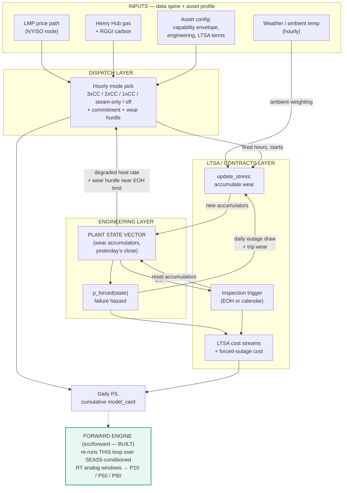
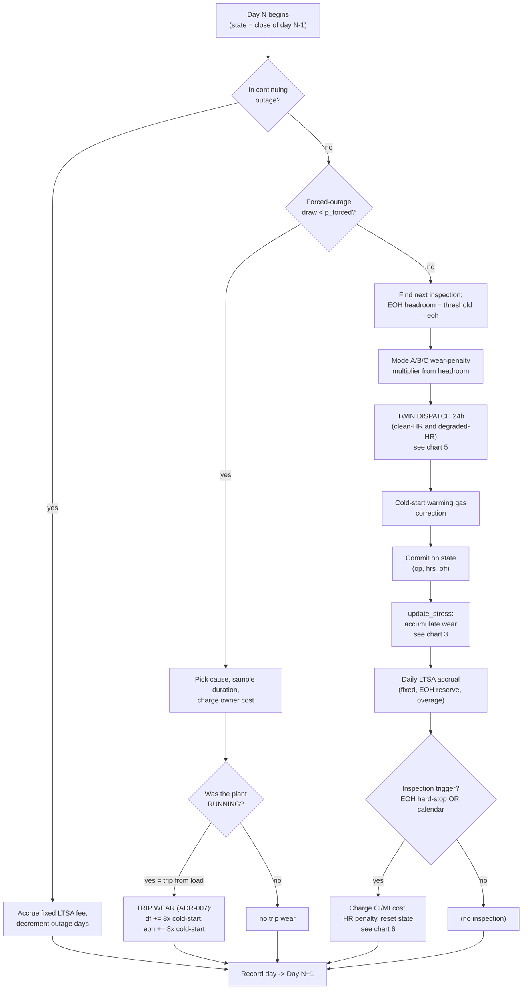
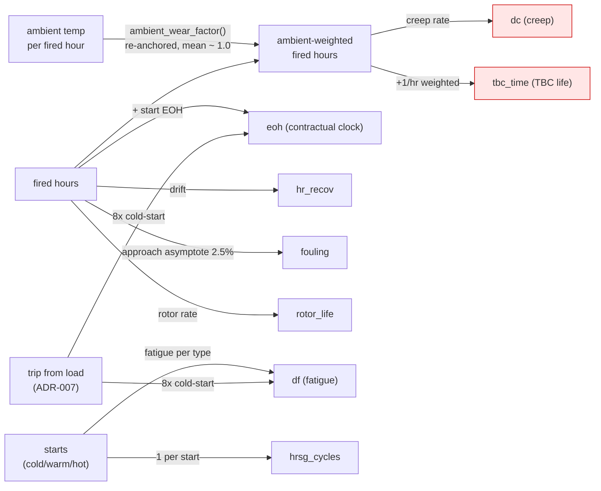
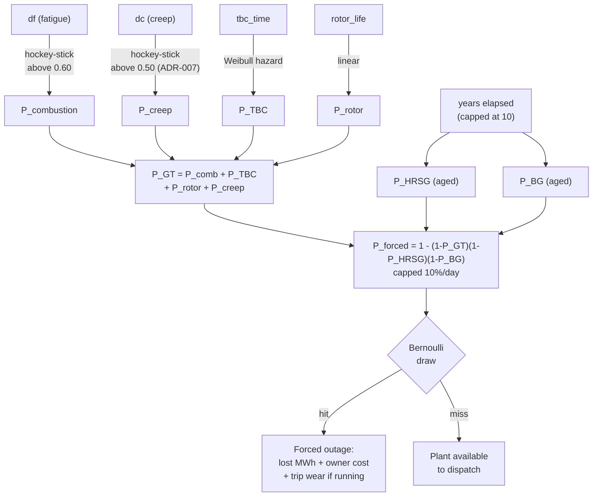
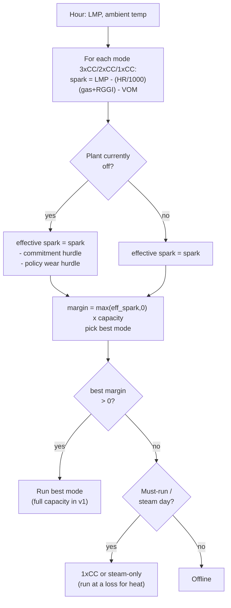
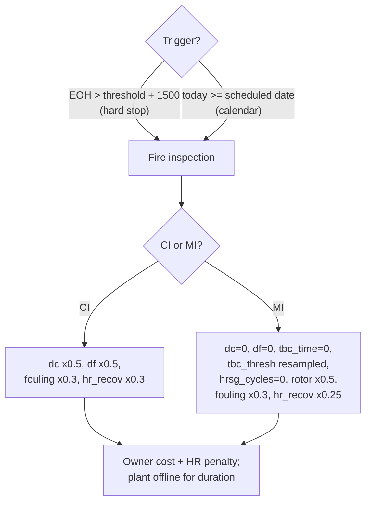
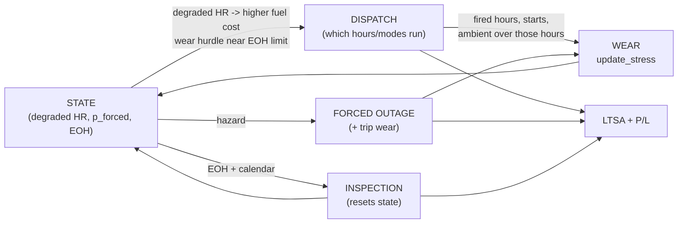
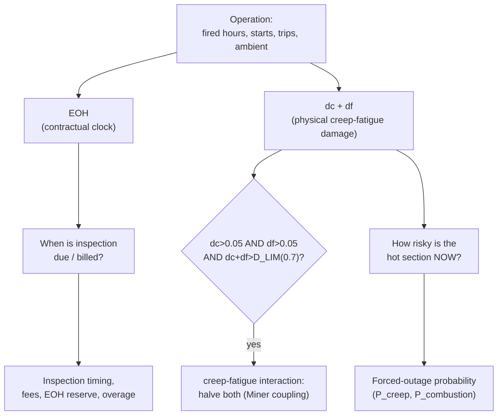
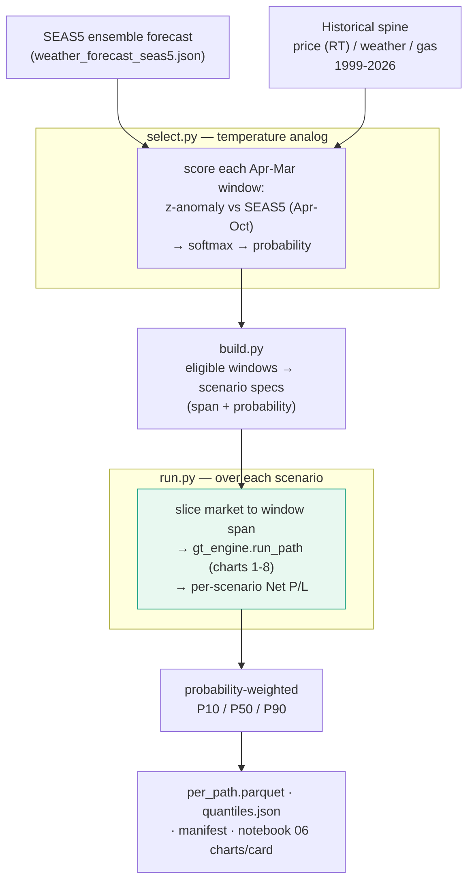

# Flow Charts — The gt_models Engine, End to End

> **Purpose**: a visual companion to [`architecture.md`](architecture.md). The big end-to-end chart shows how everything connects; the smaller charts zoom into the parts that are hard to hold in your head — the **daily feedback loop**, the **wear accumulation**, the **wear → failure** chain, the **creep-fatigue coupling**, and (chart 9) the **forward scenario engine**. All diagrams are [Mermaid](https://mermaid.js.org) (render on GitHub, VS Code, most Markdown viewers).
>
> **Where the prose lives**: [`architecture.md`](architecture.md) §2 (the three-layer loop) and §5 (the 12-step daily loop, state vector, forced-outage, inspections). This doc is the picture; that doc is the words.
>
> **Reflects**: [ADR-006](../decisions/006-ambient-weighted-wear.md) (ambient-weighted hot-section wear) and [ADR-007](../decisions/007-creep-wiring-and-trip-wear.md) (creep wired into `p_forced`; trip wear).

---

## 1. The big picture — one asset, one day, three layers, a clock

Everything in v1 is this loop, run once per day for 3,287 days × 3 policy modes. Read it as: *yesterday's state shapes today's dispatch → today's running consumes life → that drives failure risk, inspections, and cost → tomorrow inherits the new state.*

**The one loop to remember**: `STATE → DISP → WEAR → STATE`. Everything else hangs off it. The **historical** run replays the actual 2017–2025 history once per mode. The **forward engine** (green box, now built — `src/forward/`) runs this *same* loop over SEAS5-conditioned RT analog windows to produce P10/P50/P90 — see **chart 9**. (The one remaining "future" piece is swapping the in-repo analog selection for the model-gpr scenario package.)

---

## 2. The daily loop (the 12 steps)

The procedural version of the engine — what actually executes each simulated day. Mirrors [`architecture.md` §5.2](architecture.md). **Steps [1]–[2] (the outage gates) are expanded with worked examples + an enlarged sub-flowchart in [`outage_mechanics.md`](outage_mechanics.md).**

---

## 3. Wear accumulation — what feeds each accumulator

`update_stress()` turns a day's running into damage. The key nuance from [ADR-006](../decisions/006-ambient-weighted-wear.md): the **hot-section** accumulators (`dc`, `tbc_time`) advance on *ambient-weighted* fired hours; the rest on raw fired hours / starts. Trips ([ADR-007](../decisions/007-creep-wiring-and-trip-wear.md)) inject extra `df` + `eoh`. **Field-by-field math, the accumulator→consequence map, the creep/fatigue laws, and where recovery is costed are in [`wear_mechanics.md`](wear_mechanics.md).**

Pink = ambient-weighted hot-section accumulators. Note `eoh` stays on *raw* hours by design (it's the contractual clock; ambient is not a standard EOH driver — that's the deferred load half).

---

## 4. Wear → failure — how accumulators become forced-outage risk

Each accumulator maps to a component hazard; the hazards combine (independence) into a daily forced-outage probability. `P_creep(dc)` is new in [ADR-007](../decisions/007-creep-wiring-and-trip-wear.md) — it closed the gap where `dc` fed nothing.

For low-CF Lockport, `P_creep` and `P_combustion` sit near zero (sub-threshold) — the realized outages are driven by the HRSG/BoP baselines. The GT-side channels bite for high-CF / hot-running assets and across Monte Carlo paths.

---

## 5. The dispatch decision (one hour)

How an hour picks its operating mode. The **commitment hurdle** (the one principled dispatch-realism win, see [`extra/temperature_load_fidelity.md`](extra/temperature_load_fidelity.md) §9) only applies when starting from off. **The per-hour margin math (`spark → effective_spark → margin`) is decomposed with worked numbers in [`dispatch_economics.md`](dispatch_economics.md).**

Note: v1 always dispatches at **full mode capacity** when it runs (price-taker). 3xCC dominates 2xCC (best HR + most MW), so 2xCC never wins economically — the economic 2xCC and part-load output are **Stream A** work (the behavioral dispatch rule).

---

## 6. Inspection trigger + state resets

Inspections are the only thing that *reduces* wear. They fire on EOH hard-stop or calendar.

> A calendar-triggered inspection legitimately fires **below** the EOH threshold (it's time-driven). The Sanity-6 check now exempts calendar triggers from the EOH-proximity test (see [`architecture.md`](architecture.md) §7.6).

---

## 7. The feedback loop, in one frame

The compressed mental model — how the "other side" (engineering/wear) reaches dispatch, EOH, and TBC. (The expanded narrative is in the local learning log `degradation_factors/09`.)

---

## 8. Two meters, not one — the EOH vs physical-damage distinction

Why the model tracks both a contractual clock and a physical-damage state (from learning log `degradation_factors/01`).

A plant can look fine on the EOH clock while `dc+df` quietly climbs — that hidden risk is exactly why the physical meter exists.

---

## 9. The forward scenario engine (`src/forward`)

How the *same* daily engine becomes a forward P10/P50/P90 valuation. Built (RT default, ~25 analog windows). Impl docs: [`implementation/forward/`](../implementation/forward/); design: [`plans/forward_engine_plan.md`](../plans/forward_engine_plan.md).

**Key**: `run.py` calls the **same `gt_engine.run_path`** that charts 1–8 describe — once per analog window, then weights the outcomes by the temperature-analog probability. Each scenario starts from the **aged historical end-state** for that mode (`aged_start=True`, ADR-009) — not a fresh plant — so the A/B/C wear policy reflects realistic accumulated wear. RT's 25-window pool spans multiple gas regimes, surfacing the high-gas-year downside a DA-only 2017+ pool would miss. Basis is selectable (`basis="RT"` default). Caveat unchanged: absolute level isn't representative (energy-only + placeholder LTSA) — the *distribution shape* is the deliverable.

---

## Cross-references

- [`architecture.md`](architecture.md) — the prose: §2 (three-layer loop), §5 (daily loop, state vector, forced-outage, inspections), §7.6 (the Sanity-6 fix)
- [`pnl_ledger.md`](pnl_ledger.md) — the cost/revenue components behind "LTSA + P&L"
- [`dispatch_mechanics.md`](dispatch_mechanics.md) — operating mode × policy mode detail
- [`extra/temperature_load_fidelity.md`](extra/temperature_load_fidelity.md) — the commitment hurdle, ambient wear, and the deferred load half
- ADRs [006](../decisions/006-ambient-weighted-wear.md) (ambient wear) and [007](../decisions/007-creep-wiring-and-trip-wear.md) (creep wiring + trip wear)
