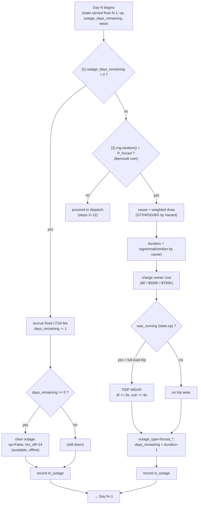

# Outage Mechanics — the daily loop's two gates (steps 1 & 2), in detail

> **What this doc is.** A zoom-in on the **first two steps** of the daily loop — *"is the plant already down?"* (step 1) and *"does it break down today?"* (step 2). It expands [`flowcharts.md`](flowcharts.md) chart 2 and [`architecture.md`](architecture.md) §5.2 into a detailed, example-driven walkthrough, including the statistics (Bernoulli, lognormal, weighted-categorical) and the honest simplifications. It is the **outage-branch** companion to [`implementation/gt_engine/05_worked_example.md`](../implementation/gt_engine/05_worked_example.md), which traces a *normal running* day.
>
> **Code**: `src/gt_engine/engine.py` — the top of `run_path`'s daily loop, plus `p_forced_components`, `sample_outage_cause`, `sample_outage_duration`.

---

## §0. The framing — two "can it run?" gates before any dispatch

Each simulated day, before the engine decides *how* to dispatch, it passes two gates:

```
[1] Already in an outage from a previous day?  ── yes ─► stay down, pay fee, count down, end day
        │ no
        ▼
[2] Does a NEW forced outage strike today?     ── yes ─► go down (cause + duration + trip wear), end day
        │ no
        ▼
   plant is available → proceed to dispatch (steps 3–12)
```

An **outage** simply means the plant is **offline** (0 MWh). There are two families:
- **Planned inspections** — CI (combustion inspection) / MI (major inspection): scheduled, multi-day/week down-times to service the hot section. (These are *triggered* later in the loop, step 12, but once active they are *handled* by gate 1.)
- **Forced outages** — unplanned equipment failures. (These are *sampled* in gate 2.)

Both kinds put the plant down for **multiple days**, tracked by one counter: `state.outage_days_remaining`.

---

## §A. Step [1] — "Am I still in an outage?"

### What it does
At the top of each day:

```python
if state.outage_days_remaining > 0:
    accrue fixed LTSA fee for the day        # you pay the contract even when down
    state.outage_days_remaining -= 1          # tick the counter down
    if state.outage_days_remaining == 0:
        state.outage_type = ""                # outage over; plant now AVAILABLE but offline
        state.op = False; state.hrs_off = 24  # it will need a start to come back
    record the day as in_outage
    continue                                  # skip dispatch / wear / inspections today
```

### Three things to understand
1. **The counter is the whole mechanism.** Whatever started the outage (CI, MI, or forced) set `outage_days_remaining` to the down-time length. Gate 1 just counts it down, one day per loop iteration. The plant is inert during these days — no dispatch, no fired-hours wear, no new inspection checks.
2. **The fixed LTSA fee still accrues.** The long-term service agreement fixed fee is like a subscription — owed whether or not the plant generates. So down-days still cost the fixed fee (but earn no spark margin → they're pure cost).
3. **The "back to available" transition.** When the counter hits 0, the outage clears: `outage_type` resets, and the plant is marked **offline** (`op=False`, `hrs_off=24`). It's now *allowed* to run again — but it's cold/idle, so the next time it runs it pays a **start** (cold/warm/hot depending on how long it's been off).

### Worked example — a 3-day tail of an outage
Suppose an outage set `outage_days_remaining = 3` on the day it fired. The next three loop iterations:

| Day | start `days_remaining` | action | end state |
|---|---|---|---|
| N+1 | 3 | accrue fee; 3→2; record in-outage; **continue** | down |
| N+2 | 2 | accrue fee; 2→1; record in-outage; **continue** | down |
| N+3 | 1 | accrue fee; 1→**0** → clear outage, `op=False`, `hrs_off=24`; record; **continue** | **available, offline** |
| N+4 | 0 | gate 1 passes → proceed to gate 2, then dispatch | may start up if economic |

That's it — gate 1 is pure bookkeeping for "the plant is in the shop; keep counting down."

---

## §B. Step [2] — "Does it break down today?"

This is where **unplanned failures** enter. We can't know *when* a specific pump or blade fails — so instead of pretending to, we **sample** it: each day there's a probability `P_forced` of a forced outage, and that probability **rises with the plant's wear state**.

### B.1 The Bernoulli draw (the "biased coin")
A **Bernoulli trial** = one **yes/no** random event with a known probability `p`. Picture a biased coin that lands **"outage"** with probability `P_forced` and **"fine"** with `1 − P_forced`. Each day we flip it:

```python
if rng.random() < P_forced:     # rng.random() is uniform on [0,1)
    ... outage fires ...
```

- `rng.random()` draws a uniform number in [0, 1). The chance it lands below `P_forced` **is exactly** `P_forced` — that's the coin flip.
- **Example**: `P_forced = 0.012` (1.2%/day). If the draw is `0.45` → `0.45 < 0.012` is false → **no outage**. If the draw had been `0.006` → `0.006 < 0.012` true → **outage fires**.
- **Why Bernoulli?** "Did it break today?" is binary with a per-day probability — the textbook Bernoulli setup. (Sum the flips over a year and the *count* of outages is Binomial — but per-day, it's just a coin.)

`P_forced` itself comes from `p_forced_components(state)` = combine (independence) the component hazards:
```
P_forced = 1 − (1 − P_GT)(1 − P_HRSG)(1 − P_BG)
  P_GT   = wear-driven (df, tbc_time, rotor_life, dc)   ← rises as the GT wears
  P_HRSG = 0.75%/day baseline × aging multiplier         ← flat background rate, creeps up with age
  P_BG   = 0.40%/day baseline × aging multiplier         ← same
```
(For low-CF Lockport the GT term is ≈0, so `P_forced` is dominated by the HRSG/BG baselines — see [`flowcharts.md`](flowcharts.md) chart 4.)

### B.2 If it fires — choice 1: which component? (weighted-categorical draw)
Given that *something* broke, attribute it to GT / HRSG / BG **in proportion to each one's hazard** — a weighted random pick (a categorical/multinomial draw):

```
weights = [P_GT, P_HRSG, P_BG] / their sum
```

- **Example**: `P_GT=0.0001, P_HRSG=0.0078, P_BG=0.0042` → normalized weights ≈ **GT 0.8% / HRSG 64% / BG 35%**. The draw most likely lands **HRSG**. The fragile-est component is the most likely culprit, but it's still a draw, not a physical observation.
- The cause matters because it routes the **repair cost** (GT $0 — OEM-covered / HRSG $500K / BG $750K) and the **duration distribution** (next).

### B.3 Choice 2: how long? (the lognormal duration)
Repair time is sampled from a **lognormal distribution** with a **per-cause median**.

**Why lognormal** — the intuition you asked about:
- A duration is **always positive** (no −3-day outage) and **right-skewed**: *most* repairs are short, but *occasionally* one drags on for weeks (waiting on a part, a big teardown).
- A normal "bell curve" is **wrong** here — symmetric and allows negatives.
- A **lognormal** is positive-only with a **long right tail** — exactly "usually short, sometimes a long one." It's the standard model for repair/duration times. ("Lognormal" = the *logarithm* of the duration is normal; the duration itself is skewed.)

Mechanically, with shape σ and a per-cause median:
```
duration = median × exp(σ × Z),   Z ~ Normal(0,1),  σ ≈ 0.5
   Z = 0  → median            Z = +1 → median × 1.65     Z = +2 → median × 2.72
   Z = −1 → median × 0.61
```
- **Example** (HRSG, median ≈ 7 days): a draw `Z = +0.4` → `7 × exp(0.2) ≈ 8.5 → ~8 days`. A rare `Z = +2` → ~19 days (the long tail). A `Z = −1` → ~4 days.
- The medians-by-cause and σ are **Bucket-B placeholders** (ADR-002) — directionally, GT failures take longest, BoP shortest.

### B.4 Trip wear — was the plant *running* when it broke?
If the plant was **online** when the outage hit, that's a **trip from load** — slamming a hot machine offline is harsh on the hot section, so we add extra wear (ADR-007, GER-3620 ~8×):

```python
was_running = state.op            # the DAILY flag carried from yesterday's close
if was_running:
    state.df  += 8 × FATIGUE_PER_COLD_START   # ≈ +0.008 fatigue
    state.eoh += 8 × START_EOH_COST["cold"]    # ≈ +160 EOH  (+ its EOH-reserve $)
```

- **How we know "was running" without intraday detail**: we *don't* time the trip. We read the **daily `state.op` flag** — whether the plant ended **yesterday** online. There is no hour-stamp; the coarse daily flag is the proxy. (Because v1 runs at full capacity when on, `op=True` ⇒ a *full-load* trip ⇒ the full 8× factor is appropriate.)
- If it was already offline → no trip wear (nothing to trip *from*).

### B.5 Mark it down + exit the day
```python
state.outage_type = f"forced_{cause}"
state.outage_days_remaining = duration - 1   # today is day 1 of the outage
record the day as in_outage
continue                                      # skip dispatch / normal wear / inspections today
```
Tomorrow, **gate 1** sees the counter and keeps the plant down until it counts back to 0.

---

## §C. The expanded sub-flowchart (gates 1 & 2)



---

## §D. A full multi-day trace (normal → forced outage → recovery)

Illustrative numbers; the point is the *flow* and how `op` / `outage_days_remaining` carry across days.

| Day | start `op` | start `days_rem` | Gate 1 | Gate 2 (draw vs P_forced) | What happens | end state |
|---|---|---|---|---|---|---|
| 100 | True | 0 | pass | 0.45 vs 0.012 → **no** | dispatch; runs all day | `op=True`, `days_rem=0` |
| 101 | True | 0 | pass | **0.004 vs 0.013 → YES** | cause→**HRSG** (64% wt); duration lognormal med 7 → **8d**; cost **$500K**; was_running=True → **trip wear** (df+0.008, eoh+160); set `forced_hrsg`, `days_rem = 7` | **down** |
| 102 | — | 7 | **down**: fee, 7→6 | — (skipped) | counting down | down |
| 103–107 | — | 6→1 | fee, decrement each day | skipped | counting down | down |
| 108 | — | 1 | fee, 1→**0** → clear: `op=False`, `hrs_off=24` | skipped | outage over | **available, offline** |
| 109 | False | 0 | pass | 0.50 → no | dispatch; if economic, **starts up** (cold/warm start, since it was off) | `op=True` if it ran |

Notice: the **trip wear** on day 101 used the `op=True` carried from day 100's close; the **fixed fee** accrued every down-day (102–108) with **zero** revenue; and day 109 the plant is cold, so re-entry costs a start.

---

## §E. Granularity & honest simplifications

- **Hourly vs daily**: only the *dispatch* decision (step 5) is hourly; **outages, wear, and these two gates are all daily**, driven by carried state + the day's totals. There is no within-day failure timing.
- **`P_forced` is daily and state-driven** (GT) + baseline×aging (HRSG/BG). The *cause* is a daily **attribution**, not an observed mechanism (§B.2).
- **"Was running" = the daily `op` flag** from yesterday's close — a proxy, since the outage is sampled *before* today's dispatch (§B.4). A finer model would time the trip against the actual running state.
- **Block-level**: the whole 3-on-1 plant is one state vector, so we can't say "CT2 tripped" — per-generator failure/timing is the v2 "per-generator state" item (`gaps_and_priorities.md` #9).
- **Coefficients** (P_forced baselines, aging, lognormal medians/σ) are **Bucket-B placeholders** (ADR-002); Phase L Monte Carlo sweeps them.

---

## §F. Cross-references
- [`architecture.md`](architecture.md) §5.2 (the 12-step loop), §5.4 (`P_forced` components)
- [`flowcharts.md`](flowcharts.md) chart 2 (the loop) + chart 4 (wear → failure hazard)
- [`implementation/gt_engine/05_worked_example.md`](../implementation/gt_engine/05_worked_example.md) — the *normal running day* companion to this *outage-branch* walkthrough
- [`implementation/gt_engine/03_function_reference.md`](../implementation/gt_engine/03_function_reference.md) — `p_forced_components`, `sample_outage_cause`, `sample_outage_duration`
- ADRs [002](../decisions/002-lockport-specific-vs-generic-calibration.md) (Bucket-B constants), [007](../decisions/007-creep-wiring-and-trip-wear.md) (trip wear)
